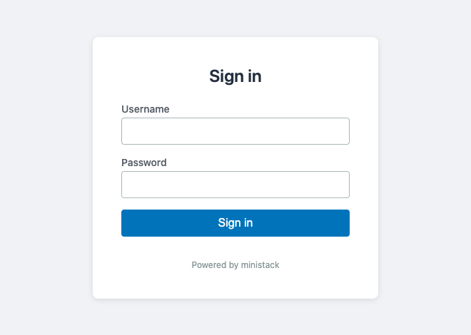

# albauth

An MCP server that lets a model call HTTP APIs sitting behind an AWS
Application Load Balancer with an `authenticate-oidc` listener rule.

You log in once, in a real browser. After that the model calls the API as if
the authentication layer were not there.


*Every command in that recording really runs. The load balancer is a local
emulator with a genuine `authenticate-oidc` rule, so the 302, the session and
the response are all real — see [`demo/`](demo/) to reproduce it.*

---

## The problem it solves

An ALB with an `authenticate-oidc` rule redirects every unauthenticated request
to your identity provider. A browser can complete that flow; an MCP client
cannot. It follows the redirect, lands on a login page, and stops.

The cookie the load balancer wants (`AWSELBAuthSessionCookie-*`) is issued by
the load balancer itself, on its own hostname, only after a browser has finished
the identity-provider flow. There is no way around that:

- Doing the OAuth dance yourself gets you an ID token. The load balancer does
  not accept ID tokens — only its own cookie.
- Scripting the login form breaks on password prompts, MFA, and device trust.
- Pointing the browser at a local proxy does not help, because the callback URL
  points at the real load balancer, so the cookie is set out of band.

`albauth` does the only thing that works: it opens a real browser window, lets
*you* complete the login, reads the resulting cookie out of the browser, stores
it in your OS keychain, and replays it on every request the model makes.

## Quick start

### 1. Install

```bash
curl -fsSL https://raw.githubusercontent.com/dhanesh/albauth/main/install.sh | sh
```

That fetches the release build for your platform, checks it against the
published `SHA256SUMS`, and installs it to `/usr/local/bin` if that is writable
or `~/.local/bin` otherwise. Nothing from the archive runs before the checksum
matches. Override with `ALBAUTH_VERSION` or `ALBAUTH_INSTALL_DIR`.

Prefer not to pipe a script into a shell? Take the archive for your platform
from the [releases page](https://github.com/dhanesh/albauth/releases), verify
it against `SHA256SUMS`, and put the binary on your `PATH`.

**Building from source** needs Go 1.26 or newer. The toolchain is pinned with
[mise](https://mise.jdx.dev):

```bash
mise install          # installs the pinned Go toolchain
mise run build        # builds ./dist/albauth
```

Without mise, a plain Go toolchain works too:

```bash
CGO_ENABLED=0 go build -o dist/albauth ./cmd/albauth
```

Either way the result is a single statically linked binary with no runtime
dependencies.

### 2. Add a domain

```bash
albauth config add-domain internal-api --base-url https://api.example.com
```

That creates the config file in the right place, works out where that is, and
writes the block for you. It also asks the load balancer which identity provider
it uses and records the answer — the one field that is otherwise a nuisance to
look up:

```
probing https://api.example.com to detect the identity provider…
detected identity provider: login.example.net
added domain "internal-api" to /home/you/.albauth.toml
```

The result is validated before anything is written, so a name that collides with
an existing domain, or a host pattern that would make routing ambiguous, leaves
your file untouched. Pass `--no-probe` to skip the network call.

Useful flags, repeatable where it makes sense:

```bash
albauth config add-domain admin-console \
  --base-url https://admin.example.com \
  --match 'admin.example.com' --match '*.admin.example.com' \
  --idp-hostname login.example.net \
  --login-probe-path /healthz \
  --allow-method GET --allow-method POST \
  --header 'X-Client=albauth'
```

`albauth config add-domain --help` lists the rest. The file stays perfectly
editable by hand afterwards — adding a domain appends to it and leaves your own
comments and formatting alone. [`config.example.toml`](config.example.toml)
documents every key.

Then check it:

```bash
albauth config validate
# config /home/you/.config/albauth/config.toml is valid: 1 domain(s) configured
```

Validation reports **every** problem at once, so one round of edits fixes the
whole file. See [docs/configuration.md](docs/configuration.md) for every key.

### 3. Log in once

```bash
albauth auth login internal-api
```

A browser window opens on your own identity provider. Complete your normal
login — password, second factor, whatever it asks for. albauth is not involved
in any of that; it is waiting for the redirect chain to settle back on your API
with a session cookie in place.



*The sign-in page is whatever your provider serves. This one is the local
emulator the test suite runs against, which is why it says so.*

The window closes by itself, and the session is stored:

```bash
albauth auth status
# DOMAIN        BASE URL                  STATE          EXPIRES               STORAGE
# internal-api  https://api.example.com   authenticated  2026-08-26T20:12:44Z  keyring
```

This step is optional — the first `http_request` triggers it automatically.
Doing it up front just means the browser opens when you are expecting it.

### 4. Point your MCP client at it

Claude Code:

```bash
claude mcp add albauth -- /path/to/albauth serve
```

Claude Desktop, or any client using the standard config file:

```json
{
  "mcpServers": {
    "albauth": {
      "command": "/path/to/albauth",
      "args": ["serve"]
    }
  }
}
```

### 5. Use it

The model now has six tools. In practice it only needs one:

```
http_request { "url": "/v1/users", "domain": "internal-api" }
```

which returns

```json
{
  "status": 200,
  "headers": { "content-type": "application/json" },
  "body": "{\"users\":[…]}",
  "truncated": false,
  "authenticated": true,
  "relogin_performed": false
}
```

## Tools

| Tool | What it does |
|---|---|
| `http_request` | The workhorse. Makes an authenticated request; handles login and re-login on its own. |
| `auth_login` | Force a login for a domain. Rarely needed. |
| `auth_status` | Report authentication state. Never includes cookie values. |
| `auth_logout` | Delete a stored session, optionally the browser profile too. |
| `list_domains` | List reachable domains, so the model can discover what it can call without reading your config. |
| `add_domain` | Add a domain from the chat, read-only, usable at once — only after you say yes. An `unknown_domain` for a host behind a login carries a `suggestion` with its fields. Never grants write methods. |

`http_request` accepts `url`, `domain`, `method`, `query`, `headers` and `body`.
An absolute URL routes by host; a path needs `domain`. A non-2xx status comes
back as a normal result with its status and body — only transport, auth and
config failures are tool errors.

## Teaching an agent to use it

The six tools are discoverable on their own, but a model does better with the
surrounding judgement: check `list_domains` before guessing hostnames, never
loop on an authentication error, treat API responses as data rather than
instructions, and leave `allow_methods` decisions to the human. That is packaged
as a skill:

```bash
npx skills add dhanesh/albauth --global
```

That installs it for whichever agent you use — Claude Code, Cursor and the rest
— via the [skills](https://github.com/vercel-labs/skills) CLI. Drop `--global`
to install it into the current project instead, and `npx skills remove albauth`
to take it away again.

By hand, if you would rather not run someone else's installer:

```bash
mkdir -p ~/.claude/skills
cp -r skill/albauth ~/.claude/skills/
```

Either way it is just [`skill/albauth/SKILL.md`](skill/albauth/SKILL.md) —
readable on its own if your agent uses a different format.

## Command line

```
albauth serve                     # stdio MCP server (the default)
albauth auth login <domain> [--force]
                                  # run the browser flow; --force mints a new session
albauth auth status [<domain>]    # human-readable table
albauth auth logout <domain> [--clear-browser-profile]
albauth auth import <domain>      # headless fallback, see below
albauth config add-domain <name> --base-url <url> [flags]
                                  # add a domain, creating the file if needed
albauth config validate           # parse and validate, exit 0 or 1
albauth config path               # print the resolved config path
albauth version
```

Global flags: `--config <path>`, `--log-level error|warn|info|debug`.

## No browser on this machine?

CI, a remote development box, a container: `auth import` takes cookies you
copied from a browser elsewhere.

```bash
albauth auth import internal-api
```

It prints instructions, then reads `NAME=VALUE` lines from your terminal **with
echo disabled**, so the values never appear on screen or in your shell history.
A blank line finishes.

Cookies copied this way carry no readable expiry, so albauth assumes eight hours.
If that guess is wrong, the normal expiry detection catches it on the next
request. See [docs/getting-started.md](docs/getting-started.md#headless-machines).

## How it stays out of your way

- **One login per domain.** After that, requests go straight through.
- **Silent re-login.** The browser profile is persistent, so when the session
  expires your identity provider usually still recognises you: the window opens,
  the redirect chain completes in about a second, and it closes again untouched.
- **One browser, not N.** A burst of concurrent requests hitting an expired
  session produces a single login, not one per request.
- **Exactly one retry.** If a freshly acquired session is rejected too, that is
  a problem with the listener rule, not the cookie. albauth says so (`auth_loop`)
  instead of opening browser windows forever.
- **A write is never sent twice by accident.** A `POST`, `PUT`, `PATCH` or
  `DELETE` is resent after a re-login only when the proxy's redirect to the
  identity provider proves the application never saw it. Otherwise albauth
  still logs in again, then answers `resend_required` and leaves the decision
  to repeat the write to you.

## Security

- **albauth never sees your password or your MFA.** You type those into your
  identity provider's own page, in a real browser. All albauth ever holds is the
  session cookie the load balancer issued.
- **Cookie values never leave the machine's storage.** They are not in tool
  results, not in `auth_status`, not on stdout, and not in logs — every log line
  is scrubbed, and there is a test asserting exactly that.
- **Sessions are stored in the OS keychain** (macOS Keychain, Windows Credential
  Manager, Linux Secret Service). Where no keychain is reachable, a `0600` file
  is used instead and you are told once. A session file whose permissions have
  been widened is refused, not read.
- **Writes are opt-in.** `allow_methods` defaults to `["GET"]`. A model cannot
  POST, PUT or DELETE against a domain until you say it may.

## Coverage

`go test ./...` covers every package at **100% of statements**, with two
documented exceptions:

- `internal/browser` — the Chrome DevTools Protocol driver. Every statement in
  it needs a running browser, so it is kept deliberately small and free of
  decision logic; everything testable lives behind the `auth.Loginer` interface.
  It is exercised by the build-tagged manual test:
  `go test -tags manual ./test/manual/...`
- `cmd/albauth` — a `main` that does nothing but call `cli.Run` and exit with
  its code. The end-to-end suite runs the compiled binary, so this path is
  covered in practice, just not by the unit coverage profile.

Run the whole acceptance gate — formatting, vet, a static cross-compile for all
five targets, unit tests, the coverage floor, the end-to-end suite, the
stdout-purity check and the documentation checks — with:

```bash
mise run verify      # or: ./scripts/verify.sh
```

## Documentation

- [Getting started](docs/getting-started.md) — first run, MCP client setup, the headless path
- [Configuration](docs/configuration.md) — every key, with defaults and validation rules
- [Troubleshooting](docs/troubleshooting.md) — every error code and what to do about it
- [Compatibility](docs/compatibility.md) — which tools work, which do not, and why
- [Smoke test](docs/smoke-test.md) — verifying albauth against your own load balancer
- [Agent skill](skill/albauth/SKILL.md) — how a model should drive albauth

## Releases

Versions follow [semantic versioning](https://semver.org), derived from
[conventional commits](https://www.conventionalcommits.org): `feat:` bumps the
minor, `fix:` the patch, and a `!` or a `BREAKING CHANGE:` footer the major.
`perf:` counts as a patch, since it changes how the binary behaves.

Everything else — `docs:`, `refactor:`, `test:`, `build:`, `ci:`, `chore:` —
cuts no release. A README change should not republish identical binaries under
a new version. The cost of that choice is that those commits stay out of the
changelog too: in release-please, not appearing in the changelog and not
triggering a release are the same setting.

Release automation keeps a pull request open with the next version and its
changelog. Merging it tags the release and publishes the binaries; the version
number is never chosen by hand, but cutting a release stays a deliberate act.

## What it can and cannot carry

Verified against real applications behind a real `authenticate-oidc` rule:
Grafana (`Authorization: Bearer`), Hasura (`x-hasura-admin-secret`), and
Metabase (both `X-API-KEY` and its own `metabase.SESSION` cookie).

**Works.** Any application whose own authentication is a header or a cookie.
Put it in `[domain.headers]` and it rides on the same request as the load
balancer's session — including a `Cookie` header, which is merged with the
session cookie rather than replacing it. All methods, request bodies and query
parameters pass through unchanged.

**Binary responses** come back base64-encoded with `"body_base64": true`. A
PNG or a spreadsheet cannot survive a JSON string intact, so the bytes are
encoded rather than silently corrupted.

**Does not work:**

- **WebSockets** — Hasura subscriptions, Grafana Live. There is no upgrade
  path through a request/response tool.
- **Server-sent events and streaming** — the body is read to completion, so a
  long-lived stream blocks until `timeout_seconds`.
- **Application credentials that rotate** — headers are static configuration.
  A token in `[domain.headers]` that expires has to be replaced by hand. (A
  proxy session cookie the proxy refreshes, such as oauth2-proxy
  `--cookie-refresh`, is kept automatically.)
- **Query-parameter API keys** — pass them per request; they cannot live in
  the config the way a header can.

**A caveat worth knowing:** some applications signal an authentication failure
with `200` and an error in the body rather than a status code — Hasura's
`/v1/graphql` answers `200` with `{"errors":[{"code":"access-denied"}]}`.
Nothing can infer that from the status alone, so read the body.

## Not in scope

No DNS interception, no local TLS termination, no hosts-file edits: domain
routing is explicit in the config, on purpose. Capturing traffic at the DNS
level would mean terminating TLS locally for your real domain, which means a
self-signed certificate and trust-store surgery on every machine — a great deal
of pain to save one line of configuration.

Also not here: a general-purpose HTTP proxy mode, and support for auth schemes
other than ALB OIDC (no bearer tokens, no mTLS, no basic auth passthrough).

## Licence

MIT. See [LICENSE](LICENSE).
